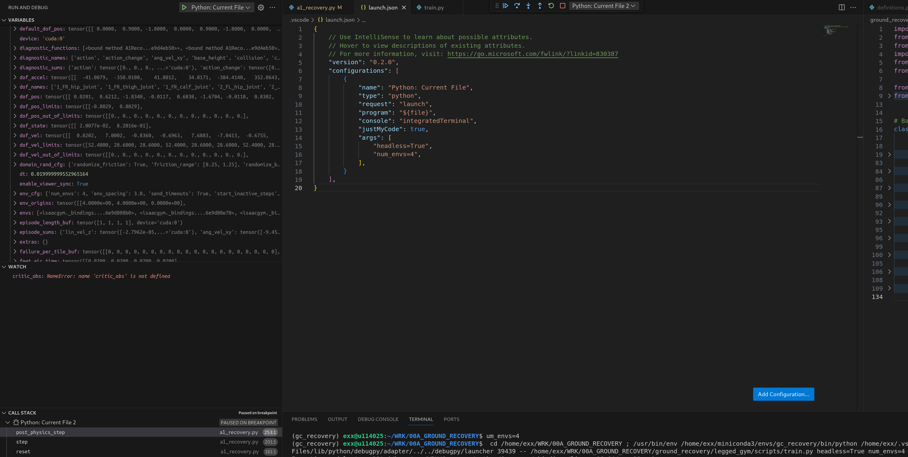

Attach to external Process IDs for debugging:

Need to "loosen" the kernel hardening to allow VSCode to inspect stuff.
```
echo 0 > /proc/sys/kernel/yama/ptrace_scope
```
Ref: https://stackoverflow.com/questions/19215177/how-to-solve-ptrace-operation-not-permitted-when-trying-to-attach-gdb-to-a-pro

## Set up debug


