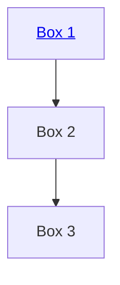

Test mermaid:

<iframe src="https://docs.google.com/document/d/e/2PACX-1vROCMbVnf0GUGJX9vr6MTh0IAmzO4dm1pG_qKt_ozKaYgxTVYCtiHk-PqHCKVbx8odAGlUpfUsDPHIS/pub?widget=true&amp;headers=false" width="1000" height="1000"></iframe>
<iframe src="https://docs.google.com/document/d/e/2PACX-1vROCMbVnf0GUGJX9vr6MTh0IAmzO4dm1pG_qKt_ozKaYgxTVYCtiHk-PqHCKVbx8odAGlUpfUsDPHIS/pub?embedded=true"></iframe>

🛑 *Access Controlled Document (requires UW github account):*
<iframe src="https://github.com/orgs/UWRobotLearning/projects" width="1000" height="1000"></iframe>
[https://github.com/orgs/UWRobotLearning/projects/1/views/1](https://github.com/orgs/UWRobotLearning/projects/1/views/1)

### Go Here