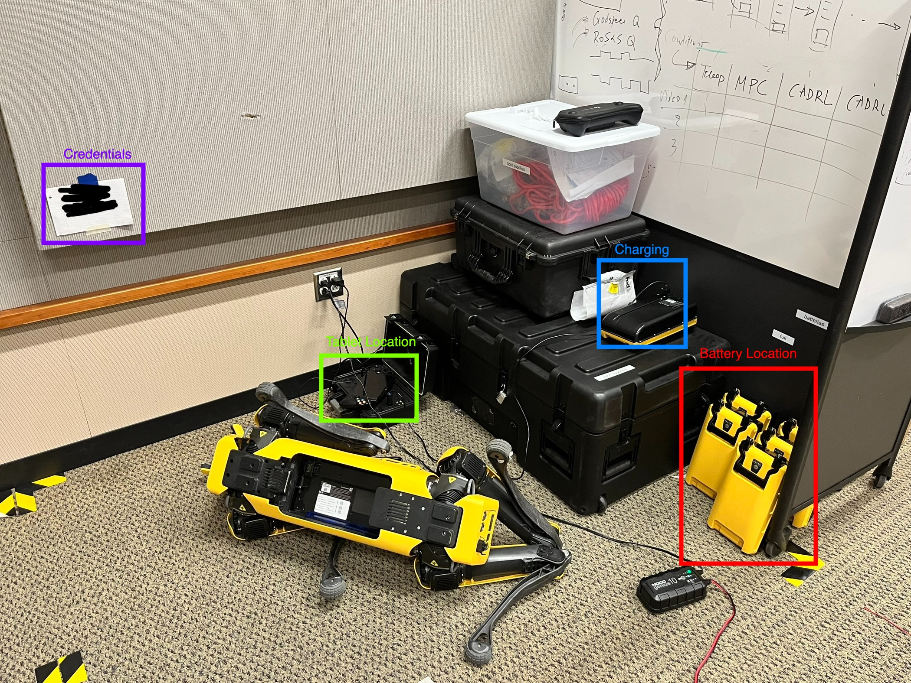

# Using the Boston Dynamics Spot 🐕

## When Not In Use

1. Controller Location
2. Battery Location
   TODO: Nil: Add photo of new battery location
4. [Charging](https://support.bostondynamics.com/s/article/Spot-Charging-Configurations)
5. Robot Storage
  - Keep robot clear of mocap arena

## Usage Procedure
1. 
4. [Automatically Roll Spot Over](https://support.bostondynamics.com/s/article/Rolling-Spot-over) (scroll down to bottom of page for instructions)
5. Remove battery from Spot belly.
6. Put battery

## Updating Firmware
[Official BD Downloads Page](https://support.bostondynamics.com/s/downloads)

### Tablet
- Download the App image (.apk) from [Downloads](https://support.bostondynamics.com/s/downloads) page and follow these steps: 
[Tablet Update Procedure](https://support.bostondynamics.com/s/article/Updating-the-Spot-system-software)
### Batteries
### Spot
